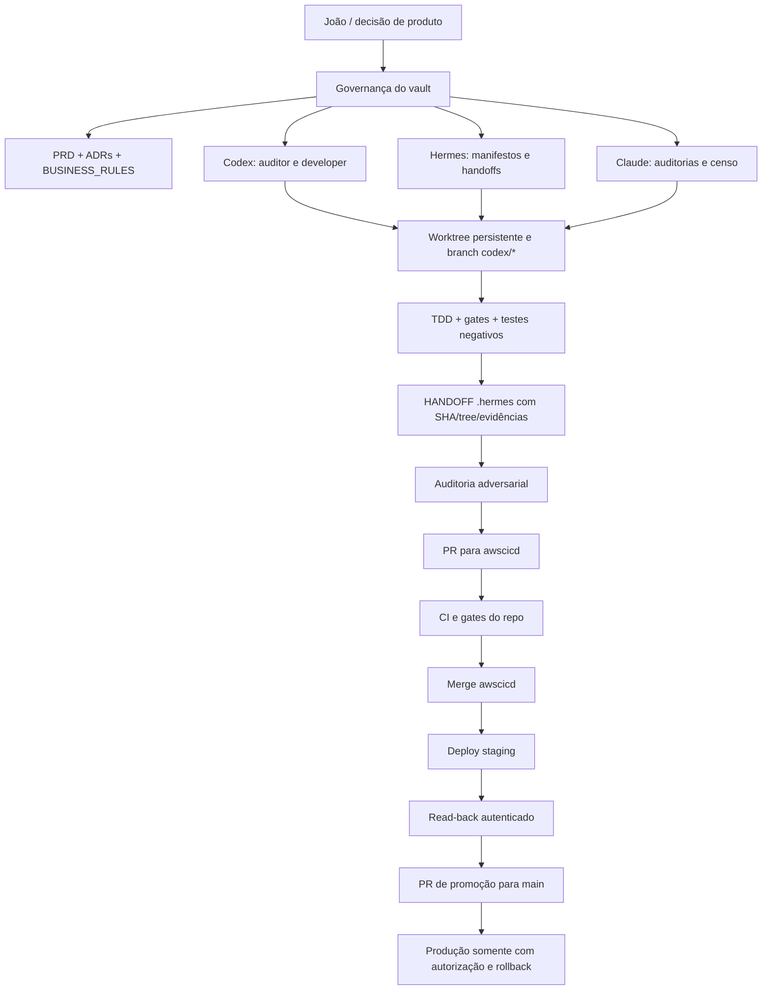
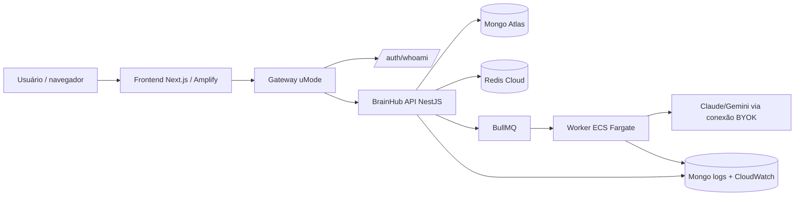
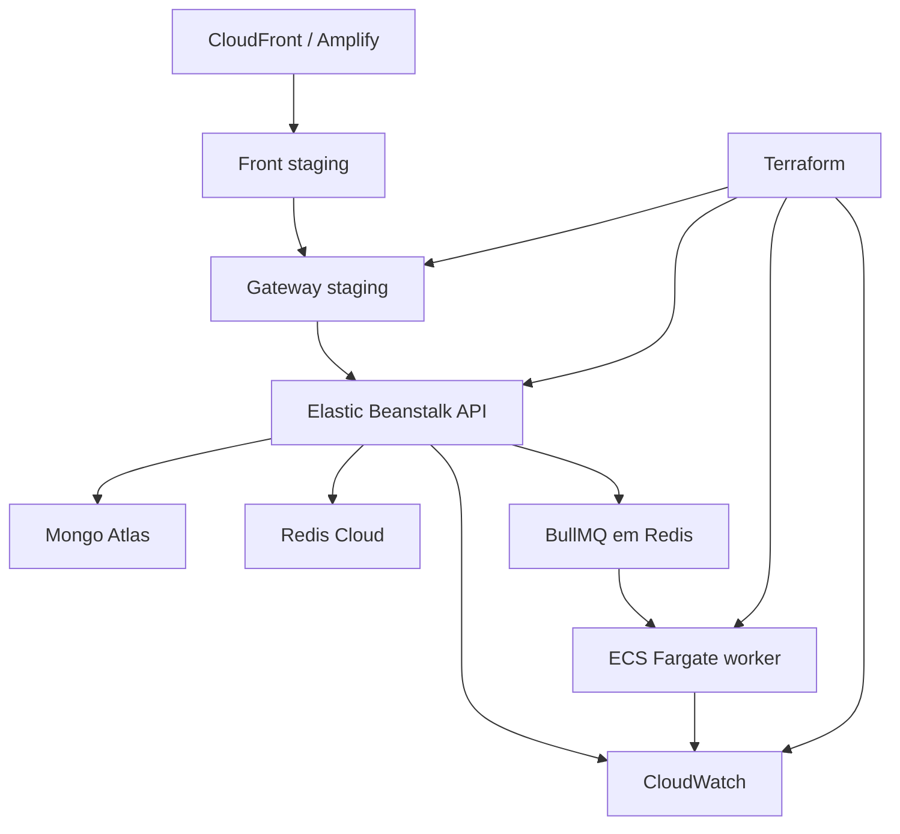
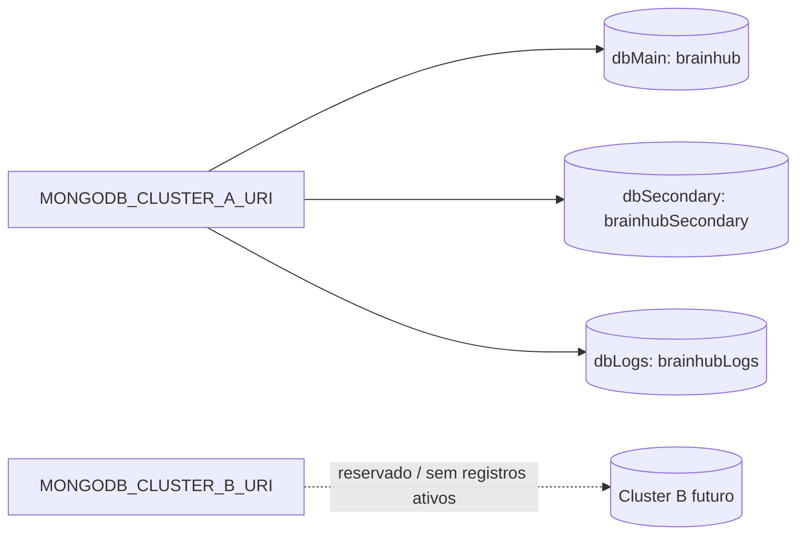
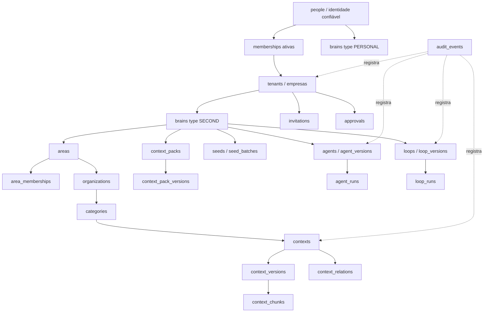
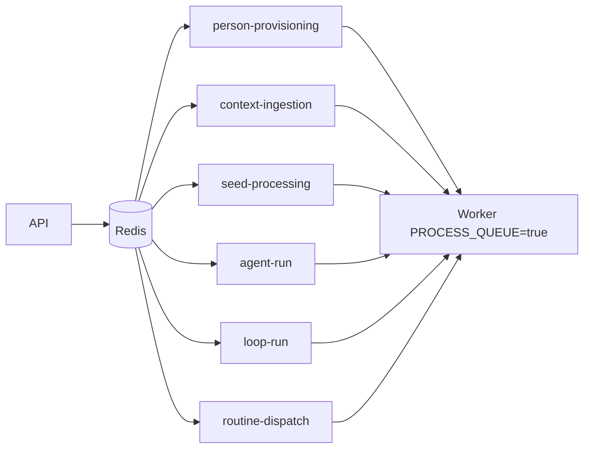
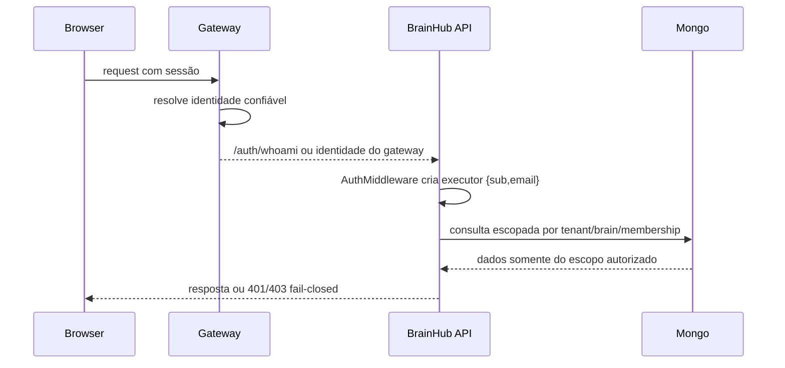
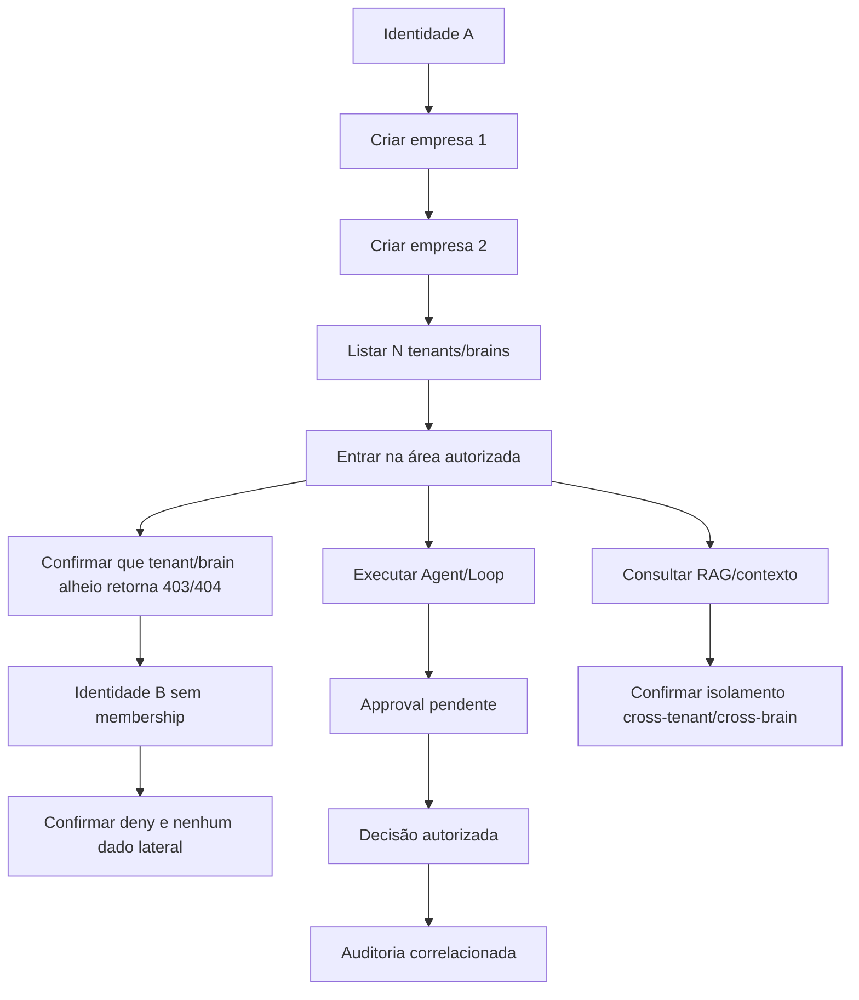

# RECEBIDO — Pacote de contexto BrainHub 2.0 (João Risoléo / Codex)

> ⚠ **DOCUMENTO EXTERNO. NÃO É NOSSO E NÃO DEVE SER EDITADO.**
> Recebido por e-mail em **18 ago 2026**, autoria **Codex** sob direção de João Risoléo,
> endereçado a Vinicius e Bergson. Armazenado a pedido do Vinicius em 18 ago 2026.
>
> **Procedência desta cópia:** transcrita do corpo da mensagem, **não do arquivo original**.
> A cópia canônica do João está em
> `/Users/joaorisoleo/uMode-OS/inbox/codex/2026-08-18-BHP-CONTEXT-PACK-VINI-BERGSON.md`.
> ⚠ **Transcrição não tem hash de procedência.** Se o `.md` original for disponibilizado (ex.: em
> `_insumos`), este arquivo deve ser **substituído pela cópia byte a byte** e ganhar `sha256`
> registrado — a mesma disciplina aplicada às instruções do agente de suporte.
>
> **Autoridade:** para **estado da plataforma**, este documento prevalece sobre os nossos. E, pela
> regra de leitura declarada nele, prevalecem sobre ele a governança do vault, o PRD e o commit
> verificável.

---

## Corpo do e-mail

Olá Vini e Bergson,

Segue o pacote de contexto completo do BrainHub 2.0 para acelerar a execução com rastreabilidade.

Resumo executivo:

- Última medição oficial: 60,5% consolidado pelo método P18.
- O documento separa código local, merge em awscicd, staging, read-back autenticado e promoção.
- Inclui mapa de documentos e repos, estado de branches/SHAs, PRD, ADRs, MongoDB com 37 collections,
  Redis/BullMQ, AWS, segurança, matriz de read-back e fluxogramas Mermaid.
- O GitHub CLI estava sem autenticação válida nesta consolidação; PRs/CI/merges precisam ser
  revalidados online antes de qualquer promoção.
- Não há segredos, tokens ou valores de credenciais neste material.

A cópia local está em:
`/Users/joaorisoleo/uMode-OS/inbox/codex/2026-08-18-BHP-CONTEXT-PACK-VINI-BERGSON.md`

---

## Documento integral

```yaml
origem: codex
criado_em: 2026-08-18
tipo: handoff-operacional
entidade: BrainHub 2.0
sync: manual
```

# BrainHub 2.0 — pacote de contexto para Vini, Bergson e agentes

Documento único de orientação para acelerar entregas sem perder rastreabilidade. Ele reúne as fontes
de produto e governança, os dois repositórios de runtime, o estado conhecido das entregas, a
arquitetura, o modelo MongoDB, filas Redis/BullMQ, ADRs existentes e as lacunas que ainda precisam de
decisão, infraestrutura ou implementação.

**Data de consolidação:** 2026-08-18

**Público:** Vini — operador de execução; Bergson — tech lead e responsável por
infraestrutura/observabilidade; Victão/PMO — coordenação de agenda; agentes técnicos que receberão
slices.

**Regra de leitura:** este documento não substitui o PRD, os `AGENTS.md` dos repos, as ADRs nem a
fonte GitHub. Ele é um mapa de entrada e um ledger de evidências. Quando houver conflito, prevalecem
a governança, o PRD e o commit verificável.

## 1. Resumo executivo

- O último número oficial disponível é **60,5% consolidado** no método P18: backend
  `61,5/98 = 62,8%`, frontend `57/98 = 58,2%`, total `(61,5 + 57) / 196 = 60,46%`, arredondado para
  `60,5%`.
- Esse número foi medido sobre SHAs anteriores aos heads atuais de `awscicd`. As correções técnicas
  P20 não devem ser convertidas automaticamente em pontos de PRD. É necessário reexecutar a mesma
  régua para obter um número atual.
- O backend atual localmente aponta para `origin/awscicd` em `24781c7` (`PR #166`, correção do
  prefixo BullMQ no healthcheck). O frontend localmente aponta para `origin/awscicd` em `32e6910`.
- O GitHub CLI desta sessão está sem autenticação válida. Portanto, PR, merge, branch remota e CI são
  classificados abaixo como **não revalidados em tempo real**, salvo quando há evidência local de
  ref, log de merge ou relatório arquivado.
- Staging público respondeu HTTP 200 em `brainhub-staging.umode.app` e `gateway-staging.umode.app`.
  Isso prova disponibilidade pública, não autenticação, isolamento, worker, escrita, aprovação ou
  read-back de negócio.
- As maiores frentes já iniciadas são: hierarquia/tenants/brains, Agents, Loops, approvals,
  membership/convites, RAG, Context Packs, Seeds, conversas, biblioteca e federação. As grandes
  frentes ainda incompletas ou sem início confiável incluem Skills, memória viva, Inbox,
  export/portabilidade, integrações externas, mobile/desktop e vários comportamentos de runtime.
- O foco operacional deve ser separar três estados: **código existente**, **entrega integrada em
  `awscicd`** e **comportamento provado em staging autenticado**. Misturar os três é a principal
  causa de superestimação do placar.

### 1.1. Escada de evidência

```mermaid
flowchart LR
    A[Requisito no PRD] --> B[Código presente]
    B --> C[Teste local passa]
    C --> D[Commit e árvore limpa]
    D --> E[PR para awscicd]
    E --> F[CI verde]
    F --> G[Merge confirmado]
    G --> H[Deploy em staging]
    H --> I[Read-back autenticado]
    I --> J[Aceite do owner]
    J --> K[Promoção autorizada]
```



**Classificação usada neste documento:**

| Estado | O que significa | Pode contar como feature? |
|---|---|---:|
| `CODE_PRESENT` | Há implementação no commit inspecionado | Não sozinho |
| `LOCAL_VERIFIED` | Gate/teste local reproduzível passou | Ainda não para runtime |
| `MERGED_AWSCICD` | Merge confirmado por ref/log/PR verificável | Sim, se o contrato estiver completo |
| `STAGING_DEPLOYED` | Há evidência do artefato implantado | Ainda não sem read-back |
| `STAGING_READBACK` | Fluxo autenticado foi executado e correlacionado | Sim, com ressalvas de aceite |
| `ACCEPTED` | Owner/PMO aceitou contra o critério do PRD | Sim |
| `MAIN_PROMOTED` | Promoção para `main` confirmada | Estado de release, não ponto adicional |
| `PRODUCTION_VERIFIED` | Smoke/read-back autenticado em produção | Release concluído |

## 2. Fluxo de colaboração e promoção



### 2.1. Regras operacionais obrigatórias

1. Ler primeiro a governança do vault e a governança do repo que será alterado.
2. Trabalhar em worktree persistente sob
   `/Users/joaorisoleo/Projects/brainhub-platform/.worktrees/`; não criar worktree, log ou repo vivo
   em `/tmp`.
3. Branch de trabalho deve ser `codex/<slice-id>`. Não usar `main` como branch de desenvolvimento.
4. Usar write set explícito e disjunto. Um agente não deve tocar arquivos fora da sua slice.
5. Fazer TDD, teste negativo das garantias críticas, lint, typecheck, unit, E2E pertinente, build,
   contract, Semgrep e Gitleaks conforme o repo.
6. Entregar commit e `.hermes/sprint/<SLICE-ID>/HANDOFF.md` mais `.hermes/sprint/<SLICE-ID>.status`
   antes do push.
7. Auditor e executor devem ser pessoas/agentes diferentes quando a missão exigir isso.
8. PR é o caminho de integração. Não considerar merge local como promoção.
9. Não usar `DELIVERY_STATUS.md` como prova única: confirmar com `git show`, árvore, testes, ref
   remota, CI e read-back.
10. Não expor segredos, valores de credencial, tokens ou conteúdo T0/T1 em relatórios.

## 3. Fontes e onde cada coisa está

### 3.1. Governança do vault

| Fonte | Localização | Uso |
|---|---|---|
| Constituição do vault | `/Users/joaorisoleo/uMode-OS/_GOVERNANCA.md` | Papéis, promoção, T0/T1, heartbeat, evidência e limites |
| Ponteiro para agentes | `/Users/joaorisoleo/uMode-OS/AGENTS.md` | Regras comuns e destino de escrita |
| Instruções do vault | `/Users/joaorisoleo/uMode-OS/CLAUDE.md` | Operação complementar |
| Catálogo de sistemas | `/Users/joaorisoleo/uMode-OS/SISTEMAS.md` | Fonte de inventário dos repos, runtime e bancos |
| Decisões do vault | `/Users/joaorisoleo/uMode-OS/DECISOES.md` | Decisões transversais já registradas |
| Fichas de papel do Codex | `.../04_Dados-e-IA/_protocolos/CODEX-AUDITOR.md` e `CODEX-DEVELOPER.md` | Auditoria e desenvolvimento |

### 3.2. PRD e documentos BrainWave

| Fonte | Localização | Uso |
|---|---|---|
| **PRD canônico** | `/Users/joaorisoleo/uMode-OS/BrainHub/uMode/03_Produto-e-Solucoes/brainhub/PRD-brainhub-prumo.md` | Requisitos, pesos, jornadas, segurança e roadmap |
| Plano técnico Hub de Agentes | `.../04_Dados-e-IA/_contexto/plano-tecnico-hub-agentes.md` | Arquitetura técnica e runtime |
| Arquitetura do conhecimento | `.../04_Dados-e-IA/_contexto/arquitetura-conhecimento-agentes.md` | Contexto, RAG e governança do conhecimento |
| Tese Fashion Context OS | `.../00_Institucional/estrategia/fashion-context-os/04-BrainHub.md` | Modelo produto/contexto |
| MCP | `.../fashion-context-os/07-MCP.md` | Contrato MCP e integrações |
| Skills e MDs | `.../fashion-context-os/08-Skills_e_MDs.md` | Capacidades ainda não completas no runtime |
| SmartCoding/BrainWave | `.../fashion-context-os/12-SmartCoding_BrainWave.md` | Operação por agentes e evolução |

### 3.3. Repositório frontend

Local: `/Users/joaorisoleo/Projects/brainhub-platform/umode-brainhub`
GitHub: `UmodeApp/umode-brainhub`

Arquivos que todo agente deve ler antes de tocar código: `AGENTS.md` · `CLAUDE.md` ·
`docs/_INDEX.md` · `docs/CONTEXT.md` · `docs/GOVERNANCE.md` · `docs/TESTING.md` ·
`docs/DELIVERY_STATUS.md`

ADRs do frontend: `ADR-0001-repository-boundaries.md` · `ADR-0002-governed-context-api-boundary.md` ·
`ADR-0003-session-token-storage-hardening.md`

Scripts principais: `lint`, `build`, `test`, `test:e2e`, `test:e2e:live`, `contract:verify`,
`contract:sync`, `format`.

### 3.4. Repositório backend

Local: `/Users/joaorisoleo/Projects/brainhub-platform/umode-brainhub-api`
GitHub: `UmodeApp/umode-brainhub-api`

Ordem obrigatória de leitura: `AGENTS.md` · `docs/_INDEX.md` · `docs/CONTEXT.md` · `docs/DOMAIN.md` ·
`docs/GOVERNANCE.md` · `docs/SECURITY.md` · `docs/DELIVERY_STATUS.md` · `CLAUDE.md`

ADRs do backend: `ADR-0001-platform-boundaries.md` · `ADR-0002-access-scope-contract.md` ·
`ADR-0003-identity-foundation.md` · `ADR-0004-governed-context-workspace.md`

Scripts principais: `lint`, `build`, `test`, `test:e2e`, `contract:verify`, `contract:generate`,
`contract:check`, `mapping-preflight`, `areas:backfill-plan`, `category-audience:preflight`,
`backfill:personal-domains`, `seed`, `mcp`, `start:worker`, `bootstrap:tenant`.

### 3.5. Repositório de referência, não runtime

`umode-frontend-boilerplate-nextjs` é boilerplate de frontend. Não deve ser usado como fonte de
implementação do BrainHub 2.0 nem como ambiente de produção.

### 3.6. Histórico e repositórios que não devem ser confundidos

- `HyTrackWater/design-system-hub`: legado preservado; produção histórica
  `https://brainhub.umode.tech`; não é o runtime atual do BrainHub 2.0.
- `HyTrackWater/brainhub-umode`: variante antiga/PowerShell; não foi validada como runtime atual.
- Produção/catalogação histórica do BrainHub 2.0: `https://brain-hub.umode.app` e
  `https://brainhub-api.umode.app`, conforme `SISTEMAS.md`. URLs de catálogo não substituem read-back
  autenticado.

### 3.7. Inbox por agente

| Origem | Diretório | Conteúdo útil |
|---|---|---|
| Codex | `/Users/joaorisoleo/uMode-OS/inbox/codex/` | Homologações, ondas, medições P18, P20, handoffs e decisões de promoção |
| Claude | `/Users/joaorisoleo/uMode-OS/inbox/claude/` | PRD V2, auditoria de escopo, censo de passivo, programa zero passivo, missões e pacote de infraestrutura |
| Hermes | `/Users/joaorisoleo/uMode-OS/inbox/hermes/` | Manifesto de sistemas, auditorias base, planos consolidados e handoffs |

Documentos de entrada prioritários:

- Codex: `2026-08-17-BHP-MEDICAO-PRD-AWSCICD-P18.md`, `2026-08-17-BHP-P20-CONTRACT-TRUTH-REPORT.md`,
  `2026-08-17-BHP-P8-COPIA-GOVERNADA-REPORT.md`, `2026-08-17-BHP-PROMOCAO-MAIN-SANDBOX-DECISAO.md`.
- Claude: `2026-08-15-COMPLETUDE-FEATURE-PRD-V2.md`, `2026-08-15-AUDITORIA-ESCOPO-VS-ENTREGA.md`,
  `2026-08-15-CENSO-PASSIVO-TECNICO-BH20.md`, `2026-08-15-PROGRAMA-ZERO-PASSIVO-BH20.md`,
  `2026-08-15-CENSO-COBERTURA-ENDPOINTS.md`, `2026-08-15-REGUA-RECONCILIADA-BH20.md`,
  `2026-08-15-PROTOCOLO-AUDITORIA-PRE-MERGE.md`, `2026-08-15-PACOTE-BERGSON-infra.md`.
- Hermes: `BRAINHUB_SYSTEMS_MANIFEST_2026-08-06.md`, `BRAINHUB_API_AUDITORIA_BASE_BERGS.md`,
  `PLANO_CONSOLIDADO_EVOLUCAO_BRAINHUB_PERSONAL_SECOND_BRAIN_2026-08-06.md`, e os handoffs
  `HANDOFF-BHP-S4-005.md`, `HANDOFF-BHP-S5-001.md`, `HANDOFF-BHP-S5-002.md`.

## 4. Repositórios, refs e promoção

### 4.1. Estado de catálogo

| Componente | Estado no `SISTEMAS.md` | Banco/runtime catalogado | URL catalogada |
|---|---|---|---|
| `umode-brainhub` | Em construção | Consome API; sem banco próprio | `https://brain-hub.umode.app` |
| `umode-brainhub-api` | Em construção | Mongo Atlas Cluster A/secondary/logs + Redis Cloud por ambiente | `https://brainhub-api.umode.app` |
| Legacy `design-system-hub` | Preservado | Separado | `https://brainhub.umode.tech` |

### 4.2. Refs locais observadas

Estas refs foram observadas localmente após fetch. Elas não substituem a confirmação da API do GitHub.

| Repo | Ref | SHA curto | Interpretação |
|---|---|---:|---|
| Front | `origin/awscicd` | `32e6910` | Head local conhecido da linha de integração |
| Front | `origin/main` | `80582cb` | Head local conhecido de main; divergência contra awscicd |
| Front | `origin/codex/bhp-p16-federation-connections-front` | `c127bed` | Slice P16 presente localmente |
| Front | `origin/codex/bhp-p20-audit-readback-front-20260818` | `dbe6f1d` | Slice P20 de auditoria/read-back presente localmente |
| Front | `origin/codex/bhp-p8-context-packs-s2-front` | `5c3a0f7` | Slice P8 Context Packs S2 presente localmente |
| Backend | `origin/awscicd` | `24781c7` | Head local conhecido; inclui correção do PR #166 no log local |
| Backend | `origin/main` | `78c05e2` | Head local conhecido de main |
| Backend | `origin/codex/bhp-p20-audit-readback-api-20260818` | `3253e41` | Slice P20 de auditoria/read-back presente localmente |
| Backend | `origin/codex/bhp-p8-empresa-aberta-api` | `960036c` | Slice P8 de criação de empresa presente localmente |
| Backend | `origin/codex/bhp-p8-seeds` | `1d45731` | Slice de Seeds presente localmente |

### 4.3. Divergência de integração

Comando usado:

```bash
git -C .../umode-brainhub     rev-list --left-right --count origin/main...origin/awscicd
git -C .../umode-brainhub-api rev-list --left-right --count origin/main...origin/awscicd
```

Resultado local:

| Repo | Resultado | Leitura |
|---|---:|---|
| Front | `1 28` | `main` tem 1 commit não presente em `awscicd`; `awscicd` tem 28 commits além de `main`; linhas divergentes |
| Backend | `0 468` | `main` é ancestral de `awscicd`; `awscicd` está 468 commits à frente localmente |

Não fazer merge cego de `awscicd` para `main` apenas por contagem de commits. Primeiro revalidar CI,
contrato, staging e rollback.

### 4.4. Estado do GitHub nesta consolidação

O `gh auth status` reportou tokens inválidos para as identidades locais disponíveis, e `gh pr list`
falhou ao conectar à API do GitHub. Logo:

- PRs e merges listados em relatórios anteriores são **evidência histórica/local**, não confirmação
  online nesta sessão.
- Antes de abrir, comentar, aprovar ou fazer merge, Vini deve reautenticar o GitHub e registrar o
  resultado.
- Não enviar token, código de autenticação ou segredo para este documento.

### 4.5. Higiene de worktrees

Há worktrees persistentes em `.../.worktrees/`, o que é o padrão desejado. Também foram encontrados
worktrees vivos sob `/private/tmp`, por exemplo `bhp-loop-legivel`, `bhp-loop-vida`, `bhp-p7-ui`,
`bhp-p7-api` e `umode-brainhub-api-p0-config`. Eles são passivo de governança porque `.git` vivo não
deve ficar em `/tmp`.

Não apagar automaticamente. A ação correta é:

1. registrar SHA, branch e estado;
2. verificar se existe PR/merge ou trabalho não preservado;
3. migrar o trabalho para worktree persistente;
4. remover somente após preservação e confirmação de integração.

Também existem worktrees de homologação e ondas anteriores sujos. Não usar worktree sujo como base de
integração:

- front `homolog-front-8acfec7`, branch `codex/homolog-front-security`, `3141b2c`, dirty;
- backend `homolog-back-d88aa08`, branch `codex/homolog-back-security`, `ae6dab8`, dirty;
- front `night-rc-final-front-ea639be`, `ea639be`, dirty;
- backend `night-rc-back-72c17d5`, `72c17d5`, dirty.

## 5. Arquitetura do produto e runtime



### 5.1. Frontend

- Next.js/React; scripts e limites estão em `package.json`, `AGENTS.md`, `CLAUDE.md` e
  `docs/TESTING.md`.
- Consome o contrato da API; não possui banco próprio catalogado.
- As superfícies de `/brain`, Agents, Loops, approvals, context packs, Seeds, biblioteca, conversas,
  federação e navegação estão em diferentes níveis de completude.
- O front não deve criar uma API paralela quando a fonte do backend já existe. O contrato deve ser
  sincronizado e verificado por `contract:verify`.

### 5.2. Backend

- NestJS 11 + TypeScript + Mongoose + Redis/BullMQ + Swagger + Jest.
- Organização esperada: Controller → Service → Repository → DB.
- Identidade confiável chega do gateway em `/auth/whoami`; o backend resolve
  `req.executor={sub,email}`. Headers de papel enviados pelo cliente não são autoridade.
- Processamento assíncrono é separado do API process por `PROCESS_QUEUE`; o worker deve subir com
  `PROCESS_QUEUE=true`.
- Logs de negócio e auditoria não devem vazar credenciais ou dados T0/T1.

### 5.3. AWS e infraestrutura observável



O código Terraform contempla staging, Elastic Beanstalk, worker ECS, artefatos/S3, CloudWatch, IAM e
pipeline. Isso é **declaração de infraestrutura**, não prova de apply. O backend Terraform remoto em
S3 está comentado; o estado local não fornece lock distribuído. Essa é uma pendência operacional
real.

### 5.4. O que foi alegado por Bergson e o que está provado

| Tema | Alegação/relato recebido | Evidência independente disponível | Estado |
|---|---|---|---|
| Staging front | Front sobe | `https://brainhub-staging.umode.app/` respondeu 200 | Disponibilidade pública confirmada; fluxo autenticado pendente |
| Gateway | Gateway sobe | `https://gateway-staging.umode.app/` respondeu 200 | Disponibilidade pública confirmada |
| API | API/EB verde | Sem read-back autenticado nesta sessão | Pendente |
| SSO | `/auth/whoami` via gateway | Sem credencial de teste; chamada sem auth respondeu 401 | Pendente com dois sujeitos |
| Worker | `PROCESS_QUEUE=true`, `API_GATEWAY_URL` e fix do BullMQ | PR #166 e código local mostram mudança; runtime/CloudWatch não foram correlacionados | Pendente em staging |
| Redis/Mongo | Serviços disponíveis | Código e configuração existem; sem query autenticada no banco | Pendente de prova operacional |
| Terraform | Plan/apply de staging | Configuração local; state/lock e artefato de apply precisam ser apresentados | Pendente |
| KMS/T0/T1 | Não há KMS; AES-256-GCM + `BYOK_MASTER_KEY` via Secrets Manager | Código mostra app-level crypto; D85 ainda sem decisão/implementação de KMS | Bloqueado por decisão/infra |
| Spot | Fargate Spot recomendado para staging | Terraform contempla Spot e fallback Fargate | Decisão de operação/custo |

## 6. Modelo de dados MongoDB

### 6.1. Topologia de conexões



Arquivo central: `.../umode-brainhub-api/src/database/mongo/mongodb-config.module.ts`

Estado observado:

- `DatabaseEnum.CLUSTER_A` registra `dbMain`, com default `brainhub`.
- `DatabaseEnum.CLUSTER_A_SECONDARY` registra `dbSecondary`, com default `brainhubSecondary`, mas não
  foram encontrados modelos de negócio ativos usando esse token.
- `DatabaseEnum.CLUSTER_B_LOGS` registra `dbLogs`, com default `brainhubLogs`; o health service faz
  ping nesse token.
- `DatabaseEnum.CLUSTER_B` existe como enum/configuração futura, sem registro de modelos ativo.
- URI, timeout de seleção e timeout de socket vêm da configuração; defaults observados incluem
  `serverSelectionTimeoutMS=3000` e `socketTimeoutMS=5000`.
- Os três destinos usam a URI do Cluster A na configuração atual. Isso não equivale a três clusters
  físicos.

### 6.2. Relação de domínio



### 6.3. Inventário das collections explícitas no código

Foram encontrados **37 nomes explícitos de collection Mongoose** no código atual. A lista abaixo é
inventário de schema/modelo, não contagem de collections existentes no Atlas. Para comprovar
existência, cardinalidade, índices reais ou drift, é necessário acesso autorizado ao banco.

| Grupo | Collections |
|---|---|
| Identidade e escopo | `people`, `tenants`, `memberships`, `brains`, `areas`, `area_memberships` |
| Hierarquia legada e contexto | `organizations`, `categories`, `contexts`, `context_versions`, `context_chunks`, `context_relations`, `category_shares`, `category_policy_audit_events` |
| Packs e ingestão | `context_packs`, `context_pack_versions`, `seeds`, `seed_batches` |
| Agents, Loops e runtime | `agents`, `agent_versions`, `loops`, `loop_versions`, `routines`, `triggers` |
| Runs, custos e auditoria | `agent_runs`, `loop_runs`, `cost_daily_counters`, `audit_events`, `approval_audit_events`, `invitation_audit_events` |
| Aprovação e tenancy | `approvals`, `invitations` |
| Arquivos e credenciais | `files`, `file_versions`, `folders`, `llm_connections`, `llm_credentials` |

### 6.4. Collections compartilhadas por mais de um domínio

- `audit_events` é append-only compartilhada por contextos, Agents, Loops, execução,
  folders/files/relations, runtime e bootstrap de tenant, com modelos/esquemas compilados distintos.
- `cost_daily_counters` é compartilhada pelas contagens diárias de Ask e de runs.
- `approval_audit_events` e `invitation_audit_events` separam trilhas de decisão/convite da trilha
  geral.
- Não deduzir isolamento por nome da collection. O isolamento é uma combinação de `tenantId`,
  `brainId`, owner/membership, filtros de repository, índice e autorização.

### 6.5. Índices e invariantes relevantes

- `people.trustedSubjectId` único.
- `tenants.slug` único.
- `memberships (personId, tenantId)` único.
- `brains`: Brain pessoal ativo único por owner e Second Brain único por tenant, usando índices
  parciais; campos relevantes incluem `type`, `tenantId`, `ownerPersonId` e `status`.
- `areas (brainId, slug)` único.
- `area_memberships (personId, areaId)` único.
- Slugs de organizations/categories são escopados por tenant, brain ou organization. Há migração para
  remover índice global que poderia causar leakage/collision.
- `contexts` possui índices de category/slug/revision; a relação entre versão e chunks deve permanecer
  coerente.
- `context_pack_versions (packId, versionNumber)` único.
- `file_versions (fileId, versionNumber)` único.
- `agent_versions (agentId, version)` único.
- `loop_versions (loopId, version)` único.
- `seeds (brainId, integrityHash)` único; batches são escopados pelo brain.
- Approvals ativas possuem unicidade por subject/ref/escopo e índices de auditoria.
- `agent_runs` e `loop_runs` possuem índices por `createdBySubjectId`, status e data; loop run tem
  dedupe por chave de execução.
- `cost_daily_counters (scope, dayUtc)` único.

### 6.6. Snapshot e operações de migração

`.../umode-brainhub-api/docs/db-snapshot.html` é um snapshot local de 2026-07-09, com 10 documentos,
e não é inventário atual autoritativo do Atlas.

Scripts de planejamento/backfill que devem ser tratados como operações controladas:

- `areas:backfill-plan`
- `category-audience:preflight`
- `backfill:chunk-area`
- `backfill:chunk-brain`
- `backfill:resource-area`
- `backfill:personal-domains`
- `migration:drop-global-slug-index`

Regra: rodar primeiro `preflight`/`plan`, guardar saída e aprovação, executar `apply` somente em
ambiente autorizado, e manter rollback ou compensação documentados. Não rodar migração real em
staging/produção durante uma slice de feature sem contrato explícito.

## 7. Redis, BullMQ e terminação



Configuração observada:

- `REDIS_HOST`, `REDIS_PORT`, `REDIS_DB`, `REDIS_USERNAME` e `REDIS_PASSWORD`.
- Prefixo BullMQ compartilhado: `bull-brainhub`.
- `PROCESS_QUEUE=false` é o comportamento esperado do processo API; `true` no worker.
- O `RedisClientShutdown` foi implementado em `src/database/redis/redis.provider.ts`, com teste de
  terminação por subprocesso em slice P3. O código não basta para provar que os dez CLIs, worker e MCP
  terminam em todos os ambientes; o teste real deve ser reexecutado no commit integrado.
- Redis também é usado para cache estrito de `/auth/whoami` e throttler. Leituras críticas de
  Person/Tenant/Membership/Brain não devem confiar em cache; em conflito, falhar fechado.
- PR #166 corrigiu no código local o prefixo usado pelo healthcheck BullMQ. É preciso correlacionar
  com revisão do task e log do worker em staging.

## 8. Identidade, autorização e segurança



- A autoridade é o gateway e o resultado de `/auth/whoami`, não um `personId` arbitrário no corpo nem
  header de role do cliente.
- O contrato esperado para teste de identidade é `id` ou `userId` canônico mais `email`, resolvido
  pelo gateway.
- Multi-tenant exige provar o mesmo sujeito com duas memberships ativas e um sujeito sem membership.
  Listar empresas ou brains sem essa prova não fecha a jornada.
- T0/T1, KMS, rotação e revogação continuam dependentes da decisão D85. A implementação atual usa
  AES-256-GCM em aplicação e `BYOK_MASTER_KEY` vindo de Secrets Manager; isso não é AWS KMS.
- Nunca colocar valor de segredo, token, código de login, chave BYOK, dump de documento ou conteúdo
  pessoal no handoff.

## 9. Estado do PRD e completude

### 9.1. Régua oficial

Fonte: `/Users/joaorisoleo/uMode-OS/inbox/codex/2026-08-17-BHP-MEDICAO-PRD-AWSCICD-P18.md`.

| Medição | Backend | Frontend | Consolidado | Observação |
|---|---:|---:|---:|---|
| P18 | `61,5/98 = 62,8%` | `57/98 = 58,2%` | `118,5/196 = 60,5%` | Última régua oficial disponível |
| P20 | sem nova pontuação | sem nova pontuação | manter `60,5%` provisório | Foco em contrato, auditoria, read-back e passivo técnico |

O documento de completude anterior de 15/08 tinha 41 features, pesos 3/2/1 e `PARCIAL=0,5`; o número
antigo de 37,8% não deve ser misturado com a régua P18.

### 9.2. Capacidades fortes ou já iniciadas

| Capacidade | Estado técnico conhecido | Evidência/ressalva |
|---|---|---|
| Identidade e executor | Implementada no backend | Read-back autenticado ainda precisa ser executado |
| Tenant, membership e brains | Base implementada | Provar duas memberships ativas e isolamento |
| Organizations/categories/contexts | Implementados em camadas | Hierarquia e backfills precisam de prova de dados reais |
| Agents | Foundation, versões e runs presentes | Nem todo comportamento operacional está fechado |
| Loops | Definições, versões e runs presentes | Muitos node types ainda são no-op; editor/runtime precisam de aceite |
| Approvals | Backend e auditoria existem | Decisão no front e alçada da Marina precisam de read-back |
| Convites/memberships | Implementados em boa parte | Aceitar/recusar, revoke e auditoria de UI devem ser testados |
| RAG/contexto | Contextos, chunks, relações e busca existem | Ingestão, isolamento e não-texto continuam condicionantes |
| Context Packs | Backend e superfície front presentes em refs atuais | S2 manifest/bundle e integração exata ainda precisam de contrato/read-back |
| Seeds | Envelope, integridade e batches presentes | Import UI/CI e extração de formatos não textuais devem ser separados |
| Conversas/chat | Superfície e API iniciadas | Chat completo do PRD não deve ser presumido |
| Biblioteca | Backend de files/versions e UI iniciados | Upload/storage real e MIME 415 eram defeitos de produção a confirmar |
| Federação | Discovery/connections/grants/audit iniciados | Conexões reais, revogação e read-back ainda não fechados |
| Rotinas/triggers | Schemas e dispatch presentes | Event bus/evaluator real ainda parcial |
| Criação de empresa | Slice de self-service existente em branches/refs | Gate de allowlist, beneficiário e duas memberships precisam revalidação no head |

### 9.3. Parcial, bloqueado ou ausente

| Área | Classificação | O que falta para deixar de ser parcial |
|---|---|---|
| Context Packs | Parcial | Contrato S2, bundle/manifest/versionamento, ingestão e read-back autenticado |
| Seeds | Parcial | Batch end-to-end, UI integrada, formatos não-textuais e prova de idempotência |
| Agents | Parcial | Execução completa, budgets, approvals e trilha operacional em staging |
| Loops | Parcial | Node types não no-op, triggers avaliados por eventos e jornada visual completa |
| Approvals | Parcial | Decisão real no front, alçada, idempotência, auditoria e isolamento |
| Biblioteca | Parcial/bloqueada por infra | Upload/storage real, MIME, scan, versões e read-back |
| Federação | Parcial | Conexão real, grants, revogação, auditoria e dois tenants |
| T0/T1 e KMS | Bloqueado | Decisão D85, KMS/rotação/revogação, testes de acesso e retenção |
| Staging/auth | Bloqueado | Credenciais de teste, duas identidades, dados seed, worker e logs correlacionados |
| Terraform | Bloqueado/risco operacional | Backend remoto/lock, plano/apply auditável e rollback |
| Skills | Ausente ou não comprovada como produto completo | Catálogo, versão, escopo, confiança, aprovação, runtime e UI |
| Memória viva | Ausente ou não comprovada como produto completo | Lifecycle, retenção, consentimento, atualização, auditoria e isolamento |
| **Inbox** | **Ausente ou não comprovada como produto completo** | **Ingestão, triagem, roteamento, status e jornada** |
| Export/portabilidade | Ausente ou bloqueada | Modelo T0/T1, autorização, formatos, redaction, job, download e auditoria |
| Integrações externas | Parcial/ausente | Conectores, credenciais, scopes, retries e read-back |
| Mobile/desktop/marketplace | Não comprovado | Escopo de produto e implementação correspondente |

### 9.4. O que não gera ponto novo automaticamente

Lint, Semgrep, Gitleaks, correções de CI, desligamento limpo do Redis, state remoto, healthcheck e
auditoria são essenciais para qualidade e preservação de pontos. Porém, segundo a régua P18, não somam
feature point por si só. Eles impedem regressão ou destravamento de release.

## 10. Entregas e PRs: como ler sem superestimar

### 10.1. Evidências arquivadas relevantes

| Evidência | O que registra | Limite |
|---|---|---|
| PR #143 | Correção de boot da API/MissingSchemaError de Tenant | Confirmar head/CI atuais no GitHub |
| PR #144 | Correção de bootstrap de Area | Confirmar head/CI atuais no GitHub |
| PR #166 | Prefixo BullMQ no healthcheck e correção do worker | Código/ref local; runtime ainda precisa de log |
| PR #156 | Relatório P20 de contrato/read-back do API, referido como merge em `0759710...` | Relatório arquivado; GitHub desta sessão não autenticado |
| PR #92 | Promoção histórica do front para `main` em `80582cb` | Ref local/histórico; não tomar como estado atual sem revalidar |
| P18 | Medição oficial `60,5%` | Base antiga em relação aos heads atuais |
| `docs/DELIVERY_STATUS.md` | Ledger de entregas e pendências | Possui entradas históricas/local; exige confirmação por SHA/CI |

### 10.2. Critério de reconciliação por entrega

Para cada PR/slice, preencher esta linha antes de contar como entregue:

```
PR/slice → branch → commit → árvore limpa → arquivos → testes → CI →
merge → artefato deployado → read-back → owner → ponto PRD
```

Se faltar qualquer coluna, marcar como pendente, não como completa. Em especial, "há branch no GitHub"
não prova merge; "CI verde" não prova deploy; "HTTP 200" não prova jornada.

## 11. Matriz mínima de read-back para Vini



Matriz objetiva:

| Jornada | Cenário positivo | Negativo obrigatório | Evidência necessária |
|---|---|---|---|
| Empresa → área → categoria → contexto | Pessoa cria/seleciona empresa e navega até contexto | Subject sem membership não lê; slug de outro tenant não atravessa | request/response, subject, tenant, brain, trace |
| Multi-empresa | Mesmo sujeito com duas memberships vê N empresas/brains | Remover uma membership esconde apenas o tenant correto | duas identidades/memberships e read-back |
| Cross-tenant/cross-brain | Contexto retorna somente no escopo | ID/slug do outro escopo retorna deny/404 sem side channel | testes e logs |
| Auth | Gateway resolve `id/userId` + email | header/body `personId` ou role forjada não altera beneficiário | request sanitizado e resposta |
| Approvals | Solicitação, decisão, auditoria | executor não autorizado, replay e decision duplicada | approval + audit event |
| Agents | Criar versão, executar, budget e resultado | sem escopo, budget excedido, run duplicado | run, status, custo, audit |
| Loops | Definir/ativar/executar trigger válido | node no-op ou trigger sem evento não pode ser contado como execução | run + evento + logs |
| RAG | Consultar contexto permitido | contexto de outro brain/tenant não aparece | query/resultados/escopo |
| Convites | Criar, aceitar e revogar convite | convite expirado, destinatário errado e revoke impedem acesso | invitation audit |
| Biblioteca | Upload/versão/consulta | MIME inválido, arquivo de outro tenant, storage indisponível | status, file version, audit |
| Context Packs/Seeds | Validar/importar versão idempotente | hash, versão, brain ou tenant errado falha fechado | envelope, batch, hash, auditoria |

## 12. ADRs existentes e ADRs ausentes

### 12.1. ADRs existentes

| Repo | ADR | Estado/documento | Gap antes de considerar decisão fechada |
|---|---|---|---|
| Front | `ADR-0001-repository-boundaries.md` | Proposta original em `awscicd`; amendment de Context Pack V2 proposto | Aceite/owner e aplicação no release |
| Front | `ADR-0002-governed-context-api-boundary.md` | Proposed | Aceite formal, contrato e read-back |
| Front | `ADR-0003-session-token-storage-hardening.md` | Proposed | Aceite, threat model e validação em ambiente |
| Backend | `ADR-0001-platform-boundaries.md` | Proposed; referência a PR #11/`ad0ca96...` | Aceite do owner e deployment |
| Backend | `ADR-0002-access-scope-contract.md` | Proposed; referência a PR #14/`6052ae5...` | AccessScope ainda não está route-wired por completo |
| Backend | `ADR-0003-identity-foundation.md` | Proposed; referência a PR #18/`1fc0a7a...` | Aceite e read-back de identidade |
| Backend | `ADR-0004-governed-context-workspace.md` | Proposed | Barreiras de migração e piloto mutável |

### 12.2. Decisões que precisam de ADR ou decisão explícita

Não foi localizada uma ADR aceita, repo-level e atual para os itens abaixo. Há missões, relatórios ou
decisões dispersas, mas isso não equivale a uma ADR aprovada:

1. D85: classificação T0/T1, KMS, rotação, revogação e envelope criptográfico.
2. Política de federação: confiança entre tenants, grant, revogação, escopo, consentimento e
   auditoria.
3. Ciclo de vida de memória viva: retenção, atualização, consentimento, deleção, export e isolamento.
4. Skills: catálogo, versão, execução, confiança, escopo, aprovação e fonte.
5. **Inbox: ownership, status, triagem, roteamento e retenção.**
6. Export/portabilidade: formatos, redaction T0/T1, job assíncrono, download, expiração e auditoria.
7. Contrato de identidade de staging e fixtures: dois usuários, duas memberships, revogação e dados
   mínimos.
8. Backend remoto e lock do state Terraform.
9. Política de worker: Fargate Spot, fallback, capacidade, retry, DLQ e SLO.
10. Contrato de Context Pack: bundle, manifest, versão, integridade, compatibilidade e rollback.
11. Autoridade de approval/alçada: subject, papel, escopo, delegação, replay e decisão final.
12. Retenção, deleção de tenant e trilha de auditoria.
13. Conectores externos: credenciais, scopes, retries, rate limits, revogação e armazenamento.

## 13. Pendências por responsável

### 13.1. Vini — execução e operação

- Reautenticar o GitHub CLI e registrar `gh auth status` sem expor token.
- Revalidar `origin/awscicd`, `origin/main`, branches de slices e PRs com SHA completo.
- Usar worktree persistente limpo, sem reutilizar raízes dirty ou `/private/tmp`.
- Executar os gates serializados de cada repo e guardar números, duração e falhas.
- Montar as fixtures de read-back: sujeito A com duas memberships; sujeito B sem membership; approval
  autorizada e não autorizada; dois brains/tenants com dados distintos.
- Provar as jornadas da seção 11 com request/response sanitizados e correlação de logs.
- Atualizar o ledger de entrega somente após commit, CI, merge, deploy e read-back correspondentes.

### 13.2. Bergson — tech lead/infraestrutura

Entregar para cada ambiente, sem segredos:

- revisão do task/artefato realmente implantado no API e worker;
- evidência de `PROCESS_QUEUE=true`, `API_GATEWAY_URL`, prefixo `bull-brainhub` e log de worker
  pronto;
- correlação CloudWatch para uma execução de `agent-run`, `loop-run`, `context-ingestion` e
  `seed-processing`;
- status real de Mongo Atlas e Redis Cloud, endpoint/cluster apenas em formato não sensível;
- plano/apply Terraform de staging, commit da IaC, status do backend remoto e lock;
- evidência de rollback testado ou roteiro executável;
- decisão D85/KMS/T0/T1, com owner e data, sem incluir material secreto;
- decisão sobre Fargate Spot, capacidade, retry, DLQ e SLO;
- dois sujeitos de teste e contrato oficial de claims do gateway.

### 13.3. Victão/PMO e João — decisão e aceite

- Fechar as ADRs listadas na seção 12.2 ou aceitar formalmente que permanecem bloqueios.
- Definir quais features entram na próxima medição e quais são apenas passivo/qualidade.
- Aprovar risco de staging, rollback, custo de worker e política de dados.
- Dar aceite de negócio para alçada, federação, memória viva, export e Skills.

## 14. Próxima sequência recomendada

Não abrir todas as frentes ao mesmo tempo. A sequência abaixo maximiza impacto sem criar conflito:

### Slice 1 — Contrato operacional e read-back de staging

**Objetivo:** transformar infraestrutura alegada em prova observável.
**Write set:** testes de contrato/read-back, fixtures, documentação de operação e correções pequenas
de integração.
**Pré-requisitos:** GitHub autenticado, dois sujeitos de teste, Bergson fornece task revision/logs.
**Aceite:** auth, multi-tenant, cross-brain, worker, Redis, Mongo, approval e uma jornada RAG com
correlação de logs.
**Impacto no PRD:** preserva pontos e pode converter itens parciais já implementados em completos; não
contar antes da medição.

### Slice 2 — Context Packs/Seeds end-to-end

**Objetivo:** fechar bundle/manifest/versionamento/importação idempotente e a superfície front
correspondente.
**Write set:** somente Context Packs/Seeds e contratos relacionados.
**Aceite:** upload/import validado, hash, versão, batch, retry, isolamento, rollback e read-back.
**Impacto no PRD:** é uma das frentes com maior chance de converter cascas já existentes em pontos
completos sem abrir uma plataforma nova.

### Slice 3 — Approvals + alçada + auditoria de jornada

**Objetivo:** fechar a parede de aprovação do front e a decisão de autorização sem criar novo endpoint
se o existente cobre o contrato.
**Aceite:** pending → approve/reject, idempotência, executor não autorizado, auditoria, escopo
tenant/brain e read-back.
**Impacto no PRD:** melhora jornada já contada e reduz risco de regressão; medir apenas depois do
fluxo autenticado.

### Depois das três

Priorizar Loops/event bus/node types, depois Skills, memória viva, Inbox e export. Federation, KMS e
conectores externos devem seguir ADR/decisão antes de implementação ampla.

## 15. Comandos de entrada para um agente novo

Executar a partir de uma worktree persistente e limpa:

```bash
git status --short --branch
git log --oneline -5
git show --stat --oneline origin/awscicd
git rev-parse origin/awscicd
git diff --check origin/awscicd...HEAD
```

Frontend:

```bash
cd .../umode-brainhub
npm run lint
npm run test -- --runInBand
npm run build
npm run contract:verify
```

Backend:

```bash
cd .../umode-brainhub-api
npm run lint
npm run test -- --runInBand
npm run build
npm run contract:verify
```

Os comandos completos de E2E, Semgrep e Gitleaks devem seguir o `AGENTS.md`, `CLAUDE.md` e
`docs/TESTING.md` de cada repo. Não iniciar testes pesados dos dois repos simultaneamente.

## 16. Checklist de handoff para cada agente

```
[ ] Li a governança do vault e do repo
[ ] Li PRD/DOMAIN/BUSINESS_RULES/ADRs relevantes
[ ] Consultei SISTEMAS.md e confirmei que não estou reconstruindo algo existente
[ ] Escolhi uma slice com write set disjunto
[ ] Criei worktree persistente em .worktrees
[ ] Branch codex/<slice-id>
[ ] TDD e teste negativo das garantias críticas
[ ] Nenhuma dependência nova sem autorização
[ ] Gates locais registrados com números
[ ] Commit criado e SHA preservado
[ ] HANDOFF.md e .status criados
[ ] Árvore limpa após o handoff
[ ] Auditoria independente realizada
[ ] PR aberto para awscicd
[ ] CI verde e merge confirmado por fonte verificável
[ ] Read-back staging autenticado realizado
[ ] Rollback documentado
[ ] Nenhum processo, watcher ou worktree zumbi
```

## 17. Conclusão operacional

O BrainHub 2.0 já ultrapassou a fase de fundação vazia: existe uma base ampla de identidade, tenancy,
contexto, Agents, Loops, approvals, RAG, Context Packs, Seeds, conversas, biblioteca e federação. O
risco agora não é apenas "falta de código"; é confundir implementação parcial com jornada completa,
merge com deploy, disponibilidade com operação e healthcheck com prova de negócio.

O próximo ciclo deve ser conduzido pelo princípio **evidência antes de pontuação**. Vini pode operar
as branches, gates e read-backs; Bergson precisa fechar as provas de infraestrutura, worker, dados e
observabilidade; João/Victão precisam fechar decisões de produto e ADRs. Só depois disso a régua P18
deve ser reexecutada para produzir o percentual atual e separar pontos preservados, pontos convertidos
e features realmente novas.

## Conexões

- `[[_GOVERNANCA]]`
- `[[SISTEMAS]]`
- `[[DECISOES]]`
- `[[BrainHub/uMode/03_Produto-e-Solucoes/brainhub/PRD-brainhub-prumo]]`
- `[[inbox/codex/2026-08-17-BHP-MEDICAO-PRD-AWSCICD-P18]]`
- `[[inbox/codex/2026-08-17-BHP-P20-CONTRACT-TRUTH-REPORT]]`
- `[[inbox/claude/2026-08-15-AUDITORIA-ESCOPO-VS-ENTREGA]]`
- `[[inbox/claude/2026-08-15-CENSO-PASSIVO-TECNICO-BH20]]`
- `[[inbox/hermes/BRAINHUB_SYSTEMS_MANIFEST_2026-08-06]]`
