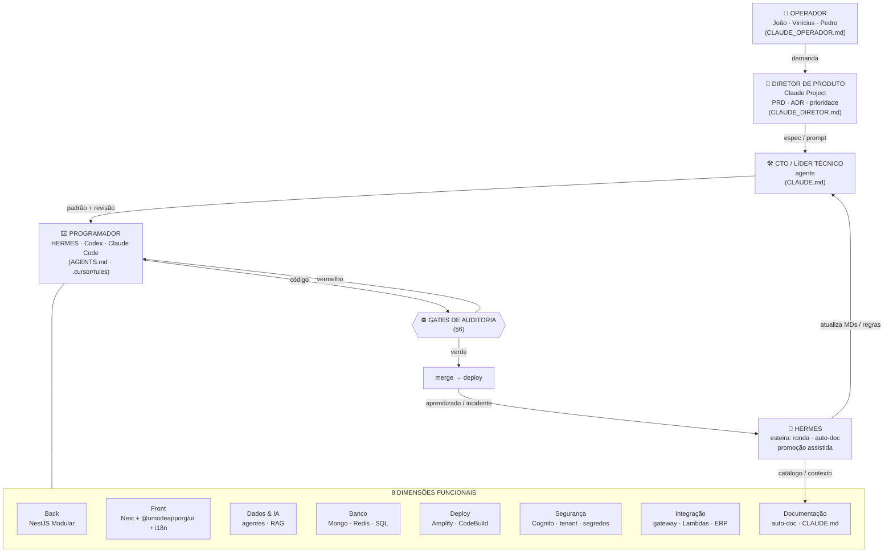
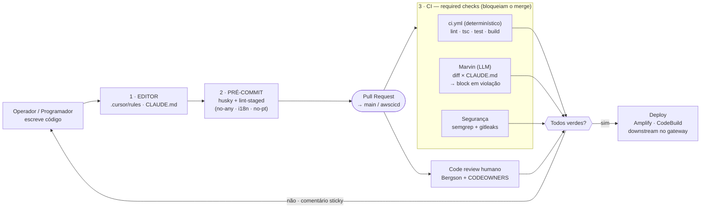
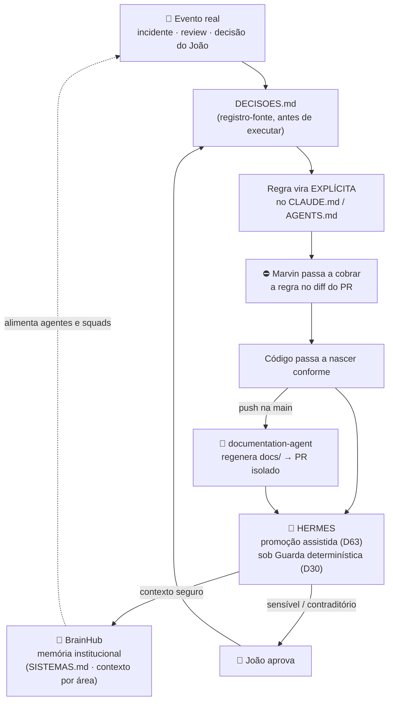

# Governança da Squad de Desenvolvimento uMode

> Documento de governança do desenvolvimento de software na uMode. Define **quem faz o quê** (os
> personagens), **sob quais premissas** (padrão, segurança), **como se audita** tudo isso, e **como o
> aprendizado retroalimenta** os documentos vivos (CLAUDE.md, CONTEXT, README, docs).
> Lastro: leitura campo a campo dos 5 repositórios de produção da `UmodeApp`, dos 2 repositórios da era
> Lovable (`HyTrackWater`) e da constituição do vault (`_GOVERNANCA.md`). Procedência por commit+SHA
> em `_contexto/_blueprint-boilerplate-governado.md` §1. Autoridade de conteúdo: CEO (João Risoléo).

## §0 — Declaração de completude (o que este documento NÃO resolve)

- **Descreve o alvo, não o estado.** O padrão descrito aqui é o que a análise recomenda; **hoje ele
  está desigual entre os repos** (o `backend-boilerplate` já cumpre quase tudo; o `fullstack` e o
  `gateway` não têm os gates). Cada afirmação carrega grau: `[C]` lido em código (arquivo citado no
  blueprint) · `[F]` existe mas só em parte dos repos · `[P]` proposta minha · `[D]` decisão do João/Bergson.
- **Não implementa.** É governança escrita; a aplicação nos repos da `UmodeApp` é escrita naquela org
  (fora do alcance de escrita deste projeto, que só grava no `brainhub-umode`).
- **A árvore de permissão fina** (quem aprova o quê, CODEOWNERS exato) fica `[D]` do João/Bergson.
- **O contrato do HERMES para código** (hoje ele é esteira do vault) é `[P]` — não existe ainda.

## §1 — Objetivo e escopo

Permitir que **operadores de negócio experientes** (João, Vinícius, Pedro e futuros) criem software na
**stack real da uMode** — como faziam no Lovable — mas com **padrão, qualidade, auditoria e segurança
travados por máquina**, não por confiança. O princípio-mestre:

> **Autonomia para criar, sem autonomia para ferir o protocolo.** A regra não é um PDF que se pede
> para ler; é um gate que barra o merge.

Escopo: todo repositório de produto/serviço da uMode (front, back, integração), a partir de um
**boilerplate-template governado**. Fora de escopo: o runtime do BrainHub 2.0 (Mongo/NestJS do João),
tratado em `_espec-banco-brainhub.md`.

## §2 — Os personagens

A squad tem **duas camadas de personagens**: os **papéis-contrato** (quem decide/executa/opera, herdados
da era Lovable) e as **oito dimensões funcionais** (as especialidades que a arquitetura exige). Cada
dimensão tem um **dono**, uma **camada de código** e um **guardrail** que a trava.

### 2.1 Papéis-contrato (arquivos lidos no início de toda sessão)

| Papel | Arquivo-contrato | Quem é | Pode / Não pode |
|---|---|---|---|
| **Operador** | `CLAUDE_OPERADOR.md` | João, Vinícius, Pedro (humanos) | Traz demanda, decide prioridade/jornada, valida entrega. Não presume aprovação sem especificar. |
| **Diretor de Produto** | `CLAUDE_DIRETOR.md` | Claude (Project) | Escreve PRD/ADR, pensa por quê/o quê, prioriza. Não commita, não roda SQL, não deploya. |
| **CTO / Líder técnico** | `CLAUDE.md` | **agente** (não é o Bergson) | Desenha o *como*, audita, dono da doc de papéis. Não altera fundação estrutural sem alinhar. |
| **Programador** | `AGENTS.md` + `.claude/*` + `.cursor/rules` | esteira **HERMES** · **Codex** · **Claude Code** | Escreve sob lint-as-código + design system. Regra anti-reversão. Não inventa padrão novo. |
| **HERMES** (esteira) | `HERMES.md` (contrato próprio) `[P]` | esteira de produção | O trilho até produção **e** um dos executores do Programador. Ronda, digests, auto-doc sob Guarda determinística. Não decide canonicidade sozinho. |

> **Fora do elenco de execução, dois pontos fixos:** o **Bergson** é o **arquiteto dos MDs de
> treinamento, governança e segurança de infra** (autoridade sobre o padrão e destino de escalonamento,
> não dono de execução por dimensão); o **Lovable saiu da stack de execução**. A **camada de orquestração
> humana** ganha mais pessoas depois desta fase.

### 2.2 As oito dimensões funcionais

| Dimensão | Dono | Camada de código | Guardrail que a trava |
|---|---|---|---|
| **Back** | CTO (agente) + Programador | `apps/server`, gateway (NestJS Modular Standard: Controller→Service→Repository, cache-aside) [C] | lint `no-any`, tsconfig estrito, Marvin (CLAUDE.md), `ci.yml` (test/build) |
| **Front** | Programador + Operador | `apps/web` (Next App Router, **`@umodeapporg/ui`** — sem shadcn; canônico `umode-frontend-boilerplate-nextjs`) [C]/[D] | eslint-rules próprias: `no-any`, `no-portuguese`, `no-literal-jsx` (i18n obrigatório) |
| **Dados & IA** | área Dados & IA | agentes, RAG, contexto, BrainHub | contratos de agente + rito de admissão (vault) |
| **Banco de Dados** | CTO (agente) — desenho | Mongo (Mongoose, multi-cluster nomeado, collection nasce no 1º write) + Redis (cache-aside, TTL obrigatório) + relacional/ERP [C] | Repository é o único acesso; chave Redis `PROJECT:MODULE:ID`; `.lean()` em leitura |
| **Deploy** | HERMES / infra | Amplify (web) + CodeBuild/Procfile (server) + registro downstream no gateway [C] | branch protection (required checks verdes antes do merge) `[P]` |
| **Segurança** | security-gate + Bergson (infra) | Cognito (auth unificada), `PartnerScopeGuard` (multi-tenant), segredos fora do repo [C] | **gitleaks** (segredos) + **semgrep** (OWASP/SAST) no PR; auth via gateway, nunca própria |
| **Integração** | squad de integração | `microservice-integration`, Lambdas, proxy `services/<nome>`, config por partner, conectores ERP [C] | allowlist de campo ao espelhar API externa (lição catalog-ai); `INTEGRATION_ID` rastreado |
| **Documentação** | documentation-agent + HERMES | `documentation-agent`/`typedoc` → PR; `CLAUDE.md`/`AGENTS.md`/`docs/`; BrainHub [C] | auto-doc em PR isolado; front-matter; `SISTEMAS.md` (D66) |

### 2.3 Diagrama — os personagens e como se ligam

## §3 — Premissas de desenvolvimento (as regras travadas)

Regras identificadas nos repos de produção `[C]`, que todo projeto herda do boilerplate:

**Arquitetura (back):** camadas estritas **Controller → Service → Repository → Database**, nunca pular;
Controller sem lógica; Service sem query bruta; Repository é o **único** acesso ao banco; `common/`
nunca importa de `modules/`. **Cache-Aside** obrigatório em leitura (Redis com **TTL sempre**), chave
`PROJECT:MODULE:ID` centralizada. Envelope de resposta `{success, data, error, requestId}`.

**Arquitetura (front):** **Server Components por padrão**, `'use client'` só quando preciso; `useEffect`
é último recurso, nunca `setState` dentro dele; **`@umodeapporg/ui`** é o padrão de UI (sem shadcn); **Zustand** só para
estado global; HTTP só via `gatewayHttpClient` (nunca `fetch` cru).

**Tipagem e estilo:** **proibido `any`** (erro de lint), `Array<T>` (não `T[]`), sem `console.*` (usar
`logger`), sem `.then/.catch` (usar `async/await`), sem chaves omitidas. **tsconfig estrito**
(`noImplicitAny`, `strictNullChecks`).

**Internacionalização (i18n):** **nenhuma string visível hardcoded** — tudo via `t('namespace.key')`,
chave presente em `pt` **e** `en`; **proibido português no código** (regra de lint própria). Sem
travessão (`—`) em texto de usuário.

**Design system:** fonte é a **biblioteca publicada `@umodeapporg/ui`** (tokens claro/escuro, preset
Tailwind, componentes, `<UmodeLogo/>`); referência viva em `designsystem.umode.tech`. **Nunca**
hex/`rgb()`/paleta Tailwind crua — nomear o **papel** (`bg-surface`, `text-foreground`,
`bg-danger-soft`). **Cânone travado `[D]` (Vinicius, set/2026):** o padrão é `@umodeapporg/ui`, **sem
shadcn** — o boilerplate canônico de front é `UmodeApp/umode-frontend-boilerplate-nextjs`.

**Auth:** **login unificado uMode** (Cognito via gateway) — o produto **não tem login próprio**;
consome o gateway (`AUTH_MODE` gateway/whoami/none, `req.executor`). Multi-tenant via
`PartnerScopeGuard` — rota com `:partnerId` só aceita o partner ativo.

**Commits:** Conventional Commits em inglês (`feat(escopo): ...`); **nunca** trailer de co-autoria de IA
nas mensagens de commit de produto.

## §4 — O padrão (o boilerplate-template)

Não se cria projeto do zero: parte-se do **`umode-fullstack-boilerplate` endurecido** como *template
repository*. "Use this template" → o repo novo **já nasce** com: os 4 contratos de papel, o lint-as-código,
o design system, o plugue do gateway, e os **3 gates de auditoria** (§6). Estrutura fixa:
`apps/web` (Next) + `apps/server` (Nest) + `.env` único na raiz. Módulo = **fatia vertical**
(schema → DTO → repository → service → controller → interface → repository front → store → hook → tela).
Nomenclatura: arquivos kebab-case, classes PascalCase com sufixo, tudo em inglês.

**Boas práticas HyTrack/Lovable que agregam ao padrão** (não estavam na produção): **PRD + ADR antes do
código** (skills `adr-writing`/`doc-coauthoring`); **guardrails de dados** do catalog-ai (allowlist de
campo ao espelhar API externa; prova determinística de deploy; "IA não valida em 1 rodada só").

## §5 — Segurança

- **Segredo nunca no repo nem em Downloads** — vai direto ao gerenciador de senhas (regra do vault,
  reforçada pelos incidentes RISC-001: credenciais de ERP em texto plano). `.env` nunca versionado.
- **gitleaks** varre segredos no range de commits de todo PR (bloqueante). `[C]`
- **semgrep** varre OWASP Top Ten + SAST js/ts/node **só no delta do PR** (achado novo = falha). `[C]`
- **Menor privilégio:** usuário de banco com role mínima por cluster; auth sempre pelo gateway;
  isolamento por tenant (`PartnerScopeGuard`) não é opcional.
- **Espelhar dado de terceiro é allowlist, nunca "traz tudo"** — filtra antes de gravar, falha fechado.

## §6 — O processo de auditoria (três camadas, determinístico antes de LLM)

A trava tem **três camadas**, do mais barato ao mais caro. Princípio herdado do vault: **o
determinístico vem antes do LLM** (a Guarda de Governança do HERMES é script, não modelo).

1. **Editor (enquanto escreve):** `.cursor/rules` + `CLAUDE.md`/`AGENTS.md` orientam o agente/operador.
2. **Pré-commit (local):** husky + lint-staged rodam o lint-as-código (`no-any`, i18n, `no-portuguese`).
   O erro aparece na hora, não no PR. `[P]`
3. **CI (no PR, required checks — sem os três verdes, não há merge):**
   - **`ci.yml`** (determinístico, o mais barato): `lint` + `tsc --noEmit` + `test` + `build` nos dois
     apps. **É a peça que o `actions-shared` não cobre e precisa ser criada.** `[P]`
   - **Marvin** (`pr-claude-md-gate`): um LLM barato (GitHub Models, gpt-4o-mini, `temperature 0`) lê o
     **diff do PR** contra o `CLAUDE.md` e retorna JSON `{compliant, violations[]}`; comenta sticky e
     **falha o check** em violação (`mode: block`). Valida *conformidade com a regra escrita*. `[C]`
   - **Segurança** (`pr-security-gate`): semgrep + gitleaks. `[C]`

**Consequência de desenho:** o Marvin julga **o diff, não o repo inteiro**, e é um LLM literal —
então **o `CLAUDE.md` tem que ser explícito, enumerável e verificável no diff** para o gate ter dente.
Isso eleva o `CLAUDE.md` de documentação a **contrato executável**: escrever a regra bem É o trabalho de
governança. Sem `CLAUDE.md`, o Marvin se auto-pula → **todo repo do template nasce com um**.

Acima das três camadas, **code review humano** (Bergson + CODEOWNERS) para o que a máquina não pega:
decisão de arquitetura, jornada de produto. E **branch protection**: PR obrigatório, sem push direto em
`main`/`awscicd`.

### 6.1 Diagrama — pipeline de auditoria

## §7 — Retroalimentação: aprender e atualizar os MDs

O sistema **aprende com o próprio erro** e transforma aprendizado em **regra executável**. O gatilho é
sempre um evento real (incidente, revisão, decisão do João); o destino é um **documento vivo**
(`CLAUDE.md`, `DECISOES.md`, `CONTEXT`, `README`, `docs/`), e — quando vira regra — o **gate passa a
cobrá-la**. Fecha o ciclo.

**As engrenagens (todas identificadas em código/governança real):**
- **`DECISOES.md` (registro-fonte):** toda decisão do João espelha-se aqui **antes** de ser executada
  (data · decisão · status). Decisão não escrita é decisão não tomada. `[C]` vault.
- **Aprendizado → regra no `CLAUDE.md`:** quando um erro se repete, ele vira uma linha explícita e
  enumerável no `CLAUDE.md` — e, por §6, o **Marvin passa a barrá-la no diff**. (Ex.: "nunca `any`"
  não é conselho, é lint + Marvin.)
- **Auto-doc (documentation-agent / typedoc):** a cada push na `main`, um agente regenera `docs/` e
  **abre um PR isolado** (nunca commita direto) — a doc segue o código sem trabalho manual. `[C]`
- **Promoção assistida (D63) + Guarda determinística (D30):** o HERMES promove contexto **seguro**
  para canônico só se o contrato dele conceder, e **todo lote passa por script determinístico** antes de
  contar como entregue. Sensível/contraditório escala para o João. `[C]` vault.
- **BrainHub como memória institucional:** o contexto refinado (este documento incluído) vira fonte
  que agentes "Por Área/Por Cliente/Por Solução" bebem — o cérebro que não reconstrói o que já sabe
  (regra D66 do `SISTEMAS.md`).

### 7.1 Diagrama — loop de retroalimentação

## §8 — Boas práticas do HyTrack/vault que agregam (e por quê)

Do mundo `HyTrackWater` (era Lovable + vault do João), o que **soma** à governança de produção:

- **Rito de admissão de agente/operador** (governança → contrato aprovado → **teste de obediência** →
  inbox → ritual): é o trilho para "criar mais operadores via BrainHub" sem afrouxar o padrão. `[C]`
- **Heartbeat (D62) + "exit 0 não é prova de trabalho" (D66):** nada entra em produção sem prova de
  vida vigiada; job que termina ≠ job que trabalhou. Aplica-se a todo cron/deploy do boilerplate. `[C]`
- **Hierarquia de verdade + `_CANON`/front-matter:** um dono por assunto; documento superado é marcado
  `SUPERSEDED` apontando o sucessor — evita "dois documentos vivos do mesmo tema". `[C]`
- **`SISTEMAS.md` (D66) — "não se constrói o que já existe":** catálogo consultado antes de criar
  pipeline/app. **Ação pendente:** trazer a produção `UmodeApp` para esse catálogo (hoje ele só tem os
  repos HyTrackWater). `[P]`
- **Os 4 papéis-contrato e o glossário risolês** (`CLAUDE_OPERADOR.md`) — a linguagem e o modo de
  decidir do João, que não mudam por projeto.

## §9 — Governança deste documento

Autoridade de conteúdo: CEO (João Risoléo); decisões de execução (`[D]`) do João/Bergson. Alteração
aqui exige refazer a leitura das fontes. Companion técnico: `_contexto/_blueprint-boilerplate-governado.md`
(a espec do boilerplate, com procedência por commit+SHA dos 8 repositórios lidos).

### Conexões
`_contexto/_blueprint-boilerplate-governado.md` · `_recebido-2026-08-18-context-pack-brainhub-2.0.md` ·
`SISTEMAS.md` (vault) · `_GOVERNANCA.md` (vault) · `protocolo-gestao-integracao.md` ·
Playbook de Engenharia uMode (GitBook)
